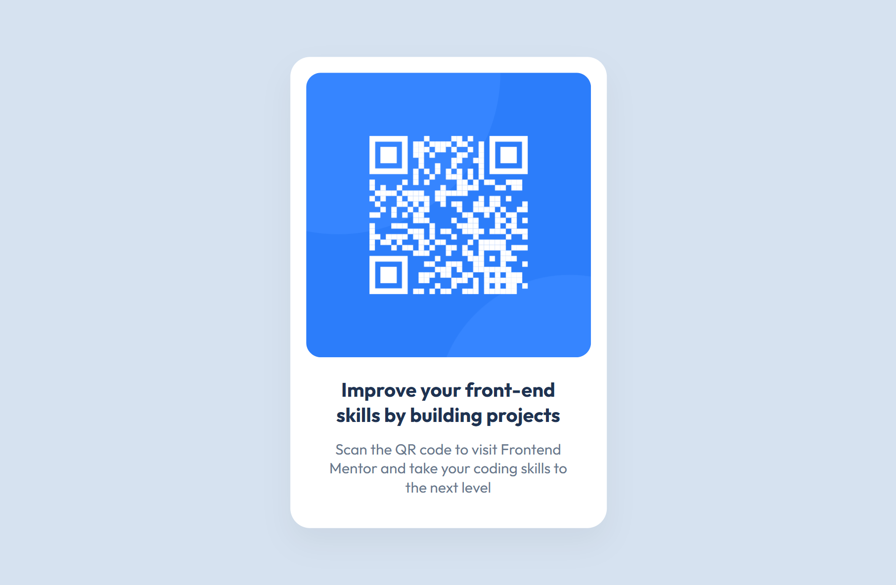

# Frontend Mentor - QR code component solution

This is my solution to the [QR code component challenge](https://www.frontendmentor.io/challenges/qr-code-component-iux_sIO_H) on Frontend Mentor.

## 📸 Screenshot

## 🔗 Links

- Solution URL: [https://github.com/your-username/qr-code-component](https://github.com/your-username/qr-code-component)
- Live Site URL: [https://your-username.github.io/qr-code-component](https://your-username.github.io/qr-code-component)

## 🚀 Built with

- Semantic HTML5
- CSS3
- Flexbox
- Mobile-first workflow
- Google Fonts (Outfit)

## 💡 What I learned

While building this project, I practised:
- Structuring a simple layout using Flexbox
- Following a design as closely as possible
- Using a mobile-first approach and improving responsiveness

## 👤 Author

- Frontend Mentor – [@TelmoManduco](https://www.frontendmentor.io/profile/TelmoManduco)
- GitHub – [@TelmoManduco](https://github.com/TelmoManduco)

